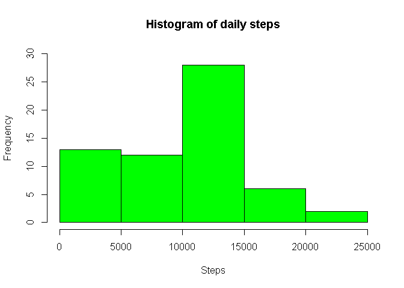
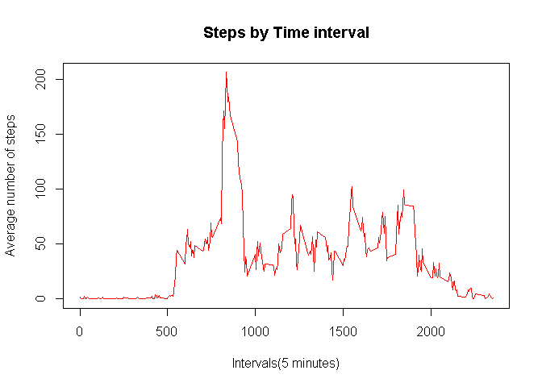
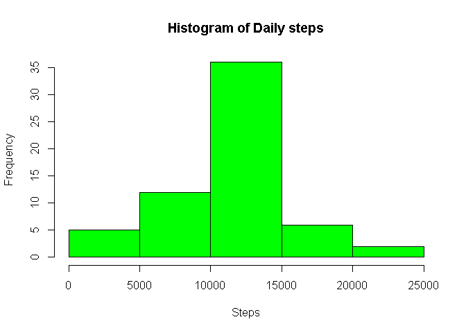
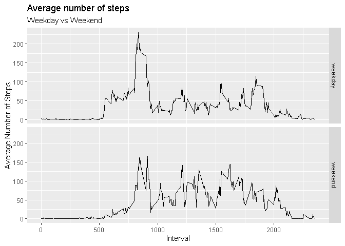

### Loading and preprocessing the data


```r
library(ggplot2)
library(dplyr)

unzip("activity.zip")
activity <- read.csv("activity.csv", header = TRUE)
activity$date <- as.Date(activity$date)
```


### What is mean total number of steps taken per day?  
#### 1.Calculate the total number of steps taken per day

```r
stepsperday <- activity %>% 
        group_by(date) %>% 
        summarize(sumsteps = sum(steps, na.rm = TRUE))
head(stepsperday)
```

```
## # A tibble: 6 x 2
##   date       sumsteps
##   <date>        <int>
## 1 2012-10-01        0
## 2 2012-10-02      126
## 3 2012-10-03    11352
## 4 2012-10-04    12116
## 5 2012-10-05    13294
## 6 2012-10-06    15420
```

#### 2.Make a histogram of the total number of steps taken each day

```r
hist(stepsperday$sumsteps, 
     main = "Histogram of daily steps", 
     col = "green", 
     xlab = "Steps",
     ylim = c(0,30))
```

<!-- -->

#### 3.Calculate and report the mean and median of the total number of steps taken per day  
###### The mean is:

```r
mean.na <- round(mean(stepsperday$sumsteps, na.rm = TRUE), digits = 2)
mean.na
```

```
## [1] 9354.23
```
###### The median is:

```r
median.na <- median(stepsperday$sumsteps, na.rm = TRUE)
median.na
```

```
## [1] 10395
```

### What is the average daily activity pattern?
#### 1. Make a time series plot (i.e.type = "l") of the 5-minute interval (x-axis) and the average number of steps taken, averaged across all days (y-axis)

```r
stepsperinterval <- activity %>% 
        group_by(interval) %>% 
        summarize(meansteps = mean(steps, na.rm = TRUE))

plot(stepsperinterval$meansteps ~ stepsperinterval$interval, 
     col = "red", 
     type = "l", 
     xlab = "Intervals(5 minutes)", 
     ylab = "Average number of steps", 
     main = "Steps by Time interval")
```

<!-- -->

#### 2. Which 5-minute interval, on average across all the days in the dataset, contains the maximum number of steps?

###### Average steps for that interval:

```r
round(max(stepsperinterval$meansteps), digits = 2)
```

```
## [1] 206.17
```
###### Interval containing the most steps on average: 

```r
stepsperinterval$interval[which.max(stepsperinterval$meansteps)]
```

```
## [1] 835
```

### Imputing missing values
#### 1. Calculate and report the total number of missing values in the dataset (i.e. the total number of rows with NAs)
###### The total number of rows with NA is:


```r
sum(is.na(activity$steps))
```

```
## [1] 2304
```

#### 2. Devise a strategy for filling in all of the missing values in the dataset. The strategy does not need to be sophisticated.  
###### The NA values from the activity data frame are replaced with the data from the averages of each 5 min interval that we calculated in previous steps. First, in the activity data frame we will look for the rows that contain NA values, then according to the time interval (5min) to which they correspond, they will be replaced by the average values calculated in the stepsperinterval data frame.

#### 3. Create a new dataset that is equal to the original dataset but with the missing data filled in.


```r
activitynoNA <- activity 
for(i in 1:nrow(activity)){
        if(is.na(activity$steps[i])){
                activitynoNA$steps[i] <- stepsperinterval$meansteps[activitynoNA$interval[i]
                                                                     == stepsperinterval$interval]
        }
}
head(activitynoNA)
```

```
##       steps       date interval
## 1 1.7169811 2012-10-01        0
## 2 0.3396226 2012-10-01        5
## 3 0.1320755 2012-10-01       10
## 4 0.1509434 2012-10-01       15
## 5 0.0754717 2012-10-01       20
## 6 2.0943396 2012-10-01       25
```

#### 4. Make a histogram of the total number of steps taken each day and calculate and report the mean and median total number of steps taken per day. Do these values differ from the estimates from the first part of the assignment? What is the impact of imputing missing data on the estimates of the total daily number of steps?


```r
stepsperdaynoNA <- activitynoNA %>% 
        group_by(date) %>% 
        summarize(sumsteps = sum(steps, na.rm = TRUE))

hist(stepsperdaynoNA$sumsteps, 
     main = "Histogram of Daily steps", 
     col = "green", 
     xlab = "Steps")
```

<!-- -->

###### The mean is: 

```r
mean(stepsperdaynoNA$sumsteps)
```

```
## [1] 10766.19
```

###### The median is: 

```r
median(stepsperdaynoNA$sumsteps)
```

```
## [1] 10766.19
```


### Are there differences in activity patterns between weekdays and weekends?

#### 1. Create a new factor variable in the dataset with two levels - “weekday” and “weekend” indicating whether a given date is a weekday or weekend day.


```r
activityw <- activitynoNA
activityw$date <- as.Date(activityw$date)
activityw$day <-ifelse(weekdays(activityw$date) %in% c("sábado", "domingo"), "weekend", "weekday")
```

#### 2. Make a panel plot containing a time series plot (i.e. type=“l”) of the 5-minute interval (x-axis) and the average number of steps taken, averaged across all weekday days or weekend days (y-axis).


```r
activityweekday <- filter(activityw, activityw$day == "weekday")
activityweekend <- filter(activityw, activityw$day == "weekend")

activityweekday <- activityweekday %>%
        group_by(interval) %>%
        summarize(steps = mean(steps))
activityweekday$day <- "weekday"

activityweekend <- activityweekend %>% 
        group_by(interval) %>%
        summarize(steps = mean(steps))
activityweekend$day <- "weekend"

weekdayweekend <- rbind(activityweekday, activityweekend)
weekdayweekend$day <- as.factor(weekdayweekend$day)

g <- ggplot(weekdayweekend, aes(interval, steps))
g + geom_line() + facet_grid(day~.) + labs(y = "Average Number of Steps") + labs(x ="Interval") +
        ggtitle("Average number of steps", subtitle = "Weekday vs Weekend")
```

<!-- -->

###### The graph shows us the trend of the average steps during the day. Differences in the average of steps are appreciated throughout the intervals between weekdays and weekends. In the case of weekdays the average of steps during the morning is higher than what is observed during the weekends. However, during the afternoon it is observed that the average number of steps on weekends is higher than on weekdays.
